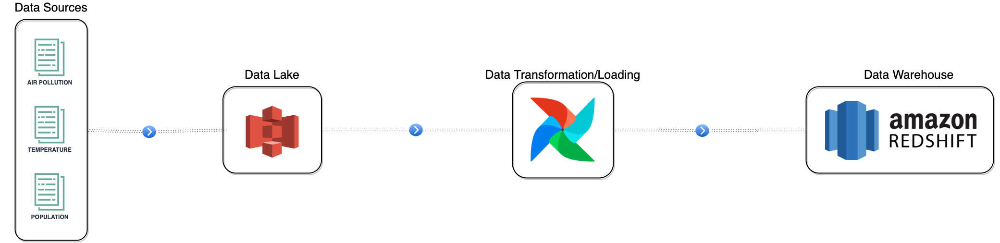
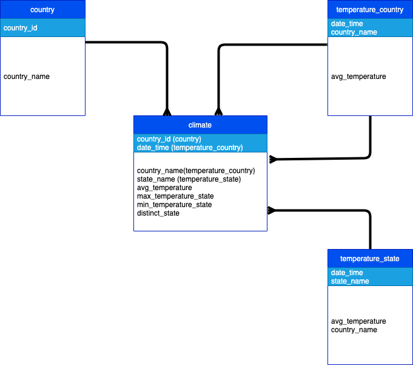

# DATA-CLIMATE-PIPELINE

## Table of content
- [Business Context](#business_context)
- [Data Sources](#data_sources)
- [System Design](#system_design)
    * [System Design - Data Lake](#system_design_data_lake)
    * [System Design - Data Transformation/Loading](#system_design_data_transformation)
    * [System Design - Data Warehouse](#system_design_data_warehouse)


<a name="business_context"/>

## Business Context
The goal of this project is to analyze the relationship between:
* `temperature`
* `country`

These are some of the questions that it will be possible to answer:
* What is the Country with the highest increase of `temperature`?
* What is the Country with the highest increase of `temperature` over last 10 years?

Eventually, this is the core question:
* What is the best Country to live in the future?

<a name="data_sources"/>

## Data Sources
* `temperature`: https://www.kaggle.com/datasets/berkeleyearth/climate-change-earth-surface-temperature-data?resource=download&select=GlobalLandTemperaturesByCountry.csv
* `country`: https://www.kaggle.com/datasets/programmerrdai/outdoor-air-pollution

<a name="system_design"/>

## System Design


The first step regards the Data Lake which is developed on S3. So, it's easy to add unstructured files on the system. For our pourpose we have CSV files with a pre-defined structured, so it's even easier to maintain them.
Then, the data source files are handled by Airflow. The workflow developed with that tool aim to clean the data source data and populate the Data Warehouse which sits on AWS - Redshift.


<a name="system_design_data_lake"/>

### System Design - Data Lake
Below there's the folder structure of the data lake on S3:
```
bucket: data-climate
│
├── temperature_country.csv
└── country.csv
```


<a name="system_design_data_transformation"/>

### System Design - Data Transformation/Loading
This steps is responsible for cleaning, transforming and loading data into datawarehouse.
Before running the pipeline, make sure to create connections to AWS from `Airflow Connection` section.


<a name="system_design_data_warehouse"/>

### System Design - Data Warehouse



